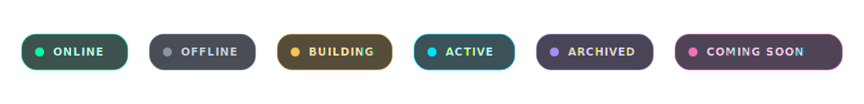
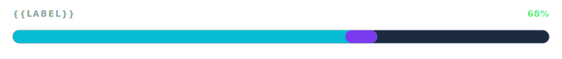
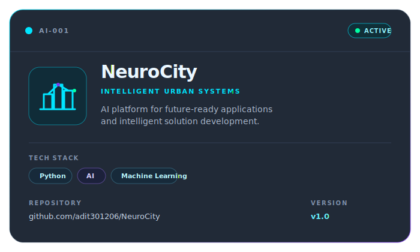
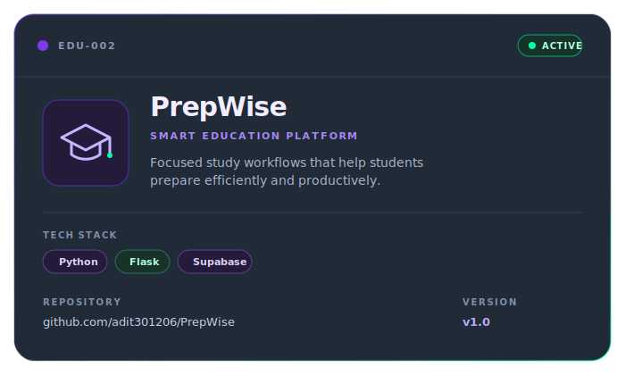
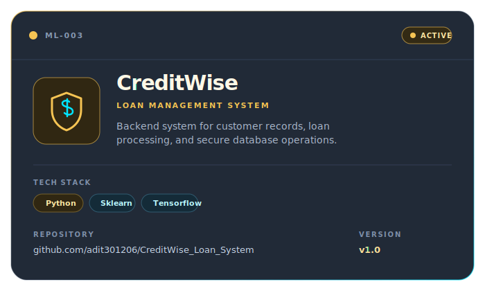
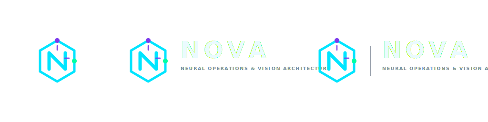
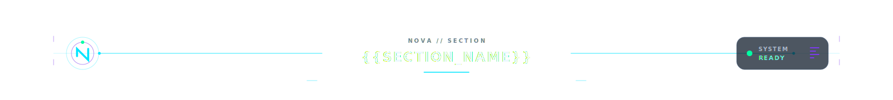
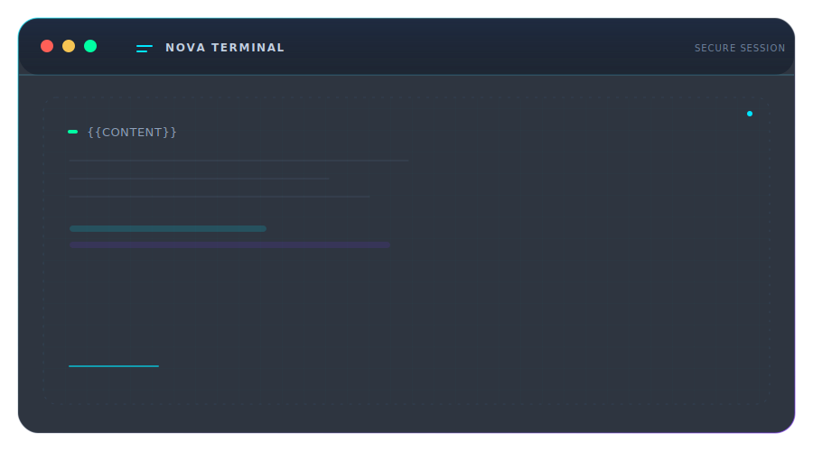
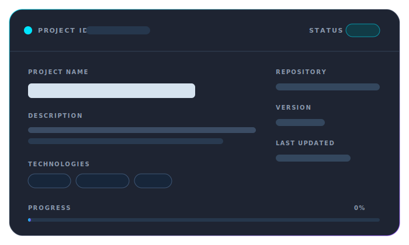
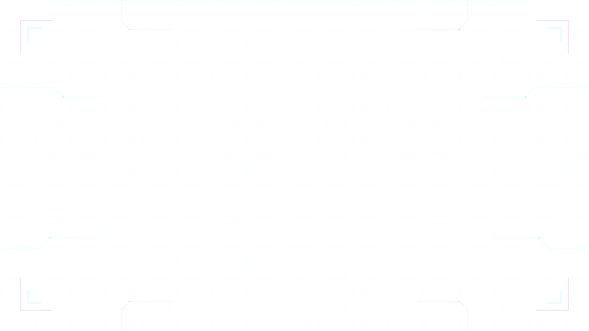

  

  

## Neural Operations Console

<table>
  <tr>
    <td width="50%" valign="top">
      <h3>Identity</h3>
      

        <strong>Adit Kapadiya</strong> 
        AI &amp; Backend Developer 
        Data Science Enthusiast
      

      
Building intelligent software that is useful, scalable, and thoughtfully engineered.

    </td>
    <td width="50%" valign="top">
      <h3>Current Mission</h3>
      <ul>
        <li>Design impactful AI products</li>
        <li>Build reliable backend systems</li>
        <li>Explore data science and machine learning</li>
        <li>Contribute to open source</li>
      </ul>
    </td>
  </tr>
</table>

  

### Core capabilities

  

  

## Technology Arsenal

  

## Active Project Database

  
    
  
    
  

  

## GitHub Analytics

  
  
   
  

  

## NOVA Interface Kit

  
<strong>Open reusable dashboard components</strong>

   
  

    
      
    
      
    
      
    
      
    
  

  

