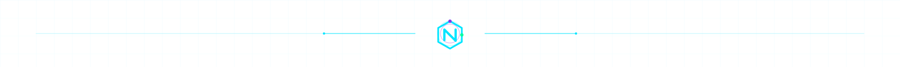
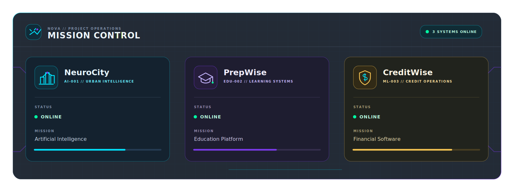

<!-- ========================================================= -->
<!--                      NOVA HERO                            -->
<!-- ========================================================= -->

  

 

 

  

---

# 🛰 Engineering Intelligence

NOVA is my personal **Engineering Intelligence Console**—a futuristic interface that showcases my work in Artificial Intelligence, Backend Engineering, and Data Science.

Every repository represents an active mission focused on solving meaningful real-world problems through software.

  

  

---

# 🚀 Mission Control

Three active engineering missions currently powering the NOVA ecosystem.

  

<a href="https://github.com/adit301206/NeuroCity">🧠 NeuroCity</a>
&nbsp;&nbsp;•&nbsp;&nbsp;
<a href="https://github.com/adit301206/PrepWise">📚 PrepWise</a>
&nbsp;&nbsp;•&nbsp;&nbsp;
<a href="https://github.com/adit301206/CreditWise_Loan_System">💳 CreditWise</a>

  

---

# 🧬 Developer DNA

Engineering isn't just about writing code—it's about continuously learning, improving, and building systems that make an impact.

---

# ⚙ Core Technology Stack

  

---

# 📊 Open Source Signal

## Open Source Signal

  

  

---

## 📈 Contribution Activity

## 🐍 Contribution Snake

## 🌌 Session Complete

*"Thank you for exploring the NOVA Engineering Intelligence Console."*

